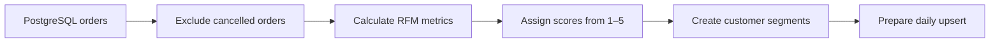

# Daily Customer RFM Pipeline

A Python and PostgreSQL pipeline that transforms e-commerce order data into daily customer segments for targeted marketing and retention.

## What is RFM?

RFM is a customer segmentation method based on three purchasing behaviours:

- **Recency:** How recently a customer placed an order
- **Frequency:** How frequently a customer places orders
- **Monetary Value:** How much money a customer spends

Together, these metrics help identify valuable, loyal, inactive and at-risk customers.

## Why does it matter?

Customers behave differently and should not all receive the same marketing treatment.

RFM segmentation helps a business understand these differences and take targeted actions, such as:

- Rewarding loyal and high-value customers
- Retaining customers who may be at risk
- Re-engaging inactive customers
- Creating more relevant marketing campaigns
- Using marketing budgets more effectively

This project automates that process by converting raw order data into daily, actionable customer segments.

## How the pipeline works

The pipeline performs the following steps:

1. Connects to a Supabase PostgreSQL database using environment variables.
2. Reads order data from `ecom.orders`.
3. Excludes cancelled orders.
4. Calculates each customer’s:
   - Recency based on their latest valid order
   - Frequency over the last 90 days
   - Monetary value over the last 90 days
5. Assigns R, F and M scores from 1 to 5 using quantile-based scoring.
6. Combines the scores into an RFM score such as `555`.
7. Assigns customer segments such as Champions, Loyal and At Risk.
8. Prepares the daily results for an idempotent PostgreSQL upsert.



## Tech stack

- Python
- PostgreSQL
- Supabase
- pandas
- psycopg2
- Jupyter Notebook
- SQL

## RFM calculations

| Metric | Calculation | Better score |
|---|---|---|
| Recency | Days since the latest non-cancelled order | Fewer days |
| Frequency | Number of orders in the last 90 days | More orders |
| Monetary Value | Total order value in the last 90 days | Higher spending |

Each metric receives a score between 1 and 5.

The scores are combined into a three-digit string:

```text
R score + F score + M score
```

For example, `555` represents a customer with the highest score for all three metrics.

Quantile-based scoring was selected because it adapts to the distribution of the customer data instead of relying on fixed business thresholds.

## Customer segments

| Segment | Rule | Possible action |
|---|---|---|
| Champions | R ≥ 4, F ≥ 4 and M ≥ 4 | Reward and retain |
| Loyal | F ≥ 4 and R ≥ 3 | Offer loyalty benefits |
| Big Spenders | M ≥ 4 and F ≤ 3 | Encourage repeat purchases |
| At Risk | R ≤ 2 and F ≥ 3 | Run win-back campaigns |
| Hibernating | R ≤ 2 and F ≤ 2 | Send re-engagement offers |
| Others | All remaining customers | Continue monitoring |

These rules are starting points. In a production system, they should be calibrated using business goals, customer behaviour and campaign performance.

## Repository structure

```text
rfm-daily-pipeline/
├── notebooks/
│   └── rfm_daily.ipynb
├── sql/
│   ├── create_customer_rfm_daily.sql
│   └── customer_rfm_metrics.sql
├── src/
│   ├── __init__.py
│   ├── db.py
│   ├── rfm.py
│   └── upsert.py
├── .env.example
├── .gitignore
├── requirements.txt
└── README.md
```

### Main components

- `notebooks/rfm_daily.ipynb` — orchestrates the complete pipeline
- `src/db.py` — manages read and write database connections
- `src/rfm.py` — calculates scores and assigns customer segments
- `src/upsert.py` — prepares and executes the idempotent upsert
- `sql/customer_rfm_metrics.sql` — calculates the raw RFM metrics
- `sql/create_customer_rfm_daily.sql` — creates the output table

## Output table

The pipeline prepares results for:

```text
ecom.customer_rfm_daily
```

The table contains:

| Column | Description |
|---|---|
| `run_date` | Date on which the pipeline was run |
| `customer_id` | Unique customer identifier |
| `recency_days` | Days since the customer’s latest order |
| `frequency_orders` | Orders placed during the last 90 days |
| `monetary_value` | Total amount spent during the last 90 days |
| `r_score` | Recency score from 1 to 5 |
| `f_score` | Frequency score from 1 to 5 |
| `m_score` | Monetary score from 1 to 5 |
| `rfm_score` | Combined score, such as `555` |
| `rfm_segment` | Assigned customer segment |

The output table uses a composite primary key:

```sql
PRIMARY KEY (run_date, customer_id)
```

This preserves daily history while allowing only one record per customer for each run date.

## Idempotent loading

The load step uses PostgreSQL’s `ON CONFLICT` clause:

```sql
ON CONFLICT (run_date, customer_id)
DO UPDATE
```

This makes the pipeline idempotent. Running it again for the same date updates the existing customer records instead of inserting duplicates.

## Installation

### 1. Clone the repository

```bash
git clone <repository-url>
cd rfm-daily-pipeline
```

### 2. Create a virtual environment

```bash
python -m venv venv
```

Activate it on Windows:

```powershell
venv\Scripts\activate
```

Activate it on Linux or macOS:

```bash
source venv/bin/activate
```

### 3. Install the dependencies

```bash
pip install -r requirements.txt
```

## Environment variables

Copy `.env.example` to `.env`.

Windows PowerShell:

```powershell
Copy-Item .env.example .env
```

Linux or macOS:

```bash
cp .env.example .env
```

Configure the database credentials:

```env
DB_HOST=your-database-host
DB_PORT=5432
DB_NAME=postgres

READ_USER=your-read-user
READ_PASSWORD=your-read-password

WRITE_USER=your-write-user
WRITE_PASSWORD=your-write-password
```

Credentials are loaded from environment variables and are not hardcoded in the source code.

The `.env` file is excluded from Git and must never be committed.

## Running the pipeline

Start Jupyter from the notebook directory:

```bash
cd notebooks
jupyter notebook rfm_daily.ipynb
```

Open the notebook and run all cells from top to bottom.

The pipeline uses the current date as its run date:

```python
run_date = date.today()
```

The same date is used when calculating the metrics and preparing the output rows.

## Dry-run mode

Database writing is disabled by default:

```python
WRITE_ENABLED = False
```

In dry-run mode, the pipeline:

- Connects with read-only credentials
- Extracts order data
- Calculates RFM metrics
- Assigns scores and customer segments
- Prepares the output rows
- Skips the database upsert

This allows the transformation logic to be tested safely without write access.

## Enabling database writes

After the output table and write credentials are available, change:

```python
WRITE_ENABLED = True
```

The pipeline will then connect using the write credentials and upsert the prepared rows into `ecom.customer_rfm_daily`.

Database insertion has not yet been verified because only read-only access is currently available.

## Daily scheduling

The notebook can be executed non-interactively using `nbconvert`.

From the repository root:

```bash
jupyter nbconvert \
  --to notebook \
  --execute notebooks/rfm_daily.ipynb \
  --output executed_rfm_daily.ipynb
```

Example cron schedule for 2:00 AM daily:

```cron
0 2 * * * cd /path/to/rfm-daily-pipeline/notebooks && /path/to/python -m jupyter nbconvert --to notebook --execute rfm_daily.ipynb --output /tmp/rfm_daily_latest.ipynb
```

On Windows, the equivalent command can be configured using Task Scheduler:

```powershell
cd D:\path\to\rfm-daily-pipeline\notebooks
python -m jupyter nbconvert --to notebook --execute rfm_daily.ipynb --output executed_rfm_daily.ipynb
```

Use absolute paths when configuring a scheduler.

## Current status

- PostgreSQL extraction implemented
- Cancelled-order filtering implemented
- RFM calculations implemented
- Quantile scoring implemented
- Customer segmentation implemented
- Idempotent upsert implemented
- Read-only dry run completed
- Database write verification pending write access