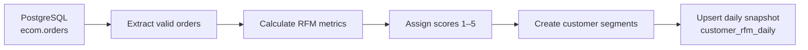

# Daily Customer RFM Pipeline

A daily analytics pipeline that transforms PostgreSQL order data into actionable customer segments for marketing and retention analysis.

**Result:** Processed **8,438 customers** and identified **1,846 Champions**, **1,338 At-Risk customers**, and **529 Big Spenders** in the latest run.

## What this project demonstrates

- PostgreSQL extraction using parameterized SQL
- 90-day customer aggregation
- Quantile-based RFM scoring
- Business-focused customer segmentation
- Idempotent PostgreSQL upserts
- Environment-based credential management
- Dry-run support for safe validation
- Notebook execution compatible with daily scheduling

## Pipeline overview



The pipeline:

1. Reads orders from `ecom.orders`.
2. Excludes cancelled orders.
3. Calculates customer-level RFM metrics.
4. Assigns percentile-based scores from 1 to 5.
5. Classifies customers into business segments.
6. Prepares an idempotent daily database upsert.

## Latest pipeline result

The pipeline was executed in dry-run mode on **June 21, 2026** using read-only database access.

| Segment | Customers | Share |
|---|---:|---:|
| Others | 2,036 | 24.1% |
| Champions | 1,846 | 21.9% |
| Hibernating | 1,748 | 20.7% |
| At Risk | 1,338 | 15.9% |
| Loyal | 941 | 11.2% |
| Big Spenders | 529 | 6.3% |
| **Total** | **8,438** | **100%** |

The run successfully extracted, transformed, scored, segmented, and prepared all **8,438 rows** for loading.

Database insertion was intentionally skipped because only read-only credentials were available.

## RFM definitions

| Metric | Definition | Scoring |
|---|---|---|
| Recency | Days since the latest non-cancelled order | Fewer days = higher score |
| Frequency | Number of orders in the last 90 days | More orders = higher score |
| Monetary | Total order value in the last 90 days | More spending = higher score |

Each metric receives a score from **1 to 5**.

The three scores are combined into an RFM code. For example:

```text
555 = highest recency, frequency and monetary scores
```

## Customer segments

| Segment | Rule |
|---|---|
| Champions | R ≥ 4, F ≥ 4 and M ≥ 4 |
| Loyal | F ≥ 4 and R ≥ 3 |
| Big Spenders | M ≥ 4 and F ≤ 3 |
| At Risk | R ≤ 2 and F ≥ 3 |
| Hibernating | R ≤ 2 and F ≤ 2 |
| Others | All remaining customers |

## Tech stack

- Python
- PostgreSQL / Supabase
- pandas
- psycopg2
- Jupyter
- SQL

## Repository structure

```text
rfm-daily-pipeline/
├── notebooks/
│   └── rfm_daily.ipynb          # End-to-end pipeline orchestration
├── sql/
│   ├── customer_rfm_metrics.sql # RFM metric extraction
│   └── create_customer_rfm_daily.sql
├── src/
│   ├── db.py                    # Database connections
│   ├── rfm.py                   # Scoring and segmentation
│   └── upsert.py                # Idempotent database load
├── .env.example
├── requirements.txt
└── README.md
```

Although the notebook coordinates the run, the database, transformation, and loading logic is separated into reusable Python modules.

## Idempotent loading

The output table uses this composite primary key:

```sql
PRIMARY KEY (run_date, customer_id)
```

The loader uses:

```sql
ON CONFLICT (run_date, customer_id)
DO UPDATE
```

Running the pipeline more than once for the same date therefore updates existing customer records instead of creating duplicates.

## Run locally

### 1. Clone the repository

```bash
git clone <repository-url>
cd rfm-daily-pipeline
```

### 2. Create a virtual environment

```bash
python -m venv venv
```

Activate it on Windows:

```powershell
venv\Scripts\activate
```

Activate it on Linux or macOS:

```bash
source venv/bin/activate
```

### 3. Install dependencies

```bash
pip install -r requirements.txt
```

### 4. Configure credentials

Copy the example configuration:

```powershell
Copy-Item .env.example .env
```

Add the database values to `.env`:

```env
DB_HOST=your-database-host
DB_PORT=5432
DB_NAME=postgres

READ_USER=your-read-user
READ_PASSWORD=your-read-password

WRITE_USER=your-write-user
WRITE_PASSWORD=your-write-password
```

The real `.env` file is excluded from Git.

### 5. Execute the notebook

Launch Jupyter from the `notebooks` directory:

```powershell
cd notebooks
jupyter notebook rfm_daily.ipynb
```

Run all cells from top to bottom.

## Dry-run and write modes

Writing is disabled by default:

```python
WRITE_ENABLED = False
```

Dry-run mode executes the extraction and transformation stages without changing the database.

After the output table and write permissions are available:

```python
WRITE_ENABLED = True
```

## Daily scheduling

The notebook can be executed non-interactively with `nbconvert`:

```bash
jupyter nbconvert \
  --to notebook \
  --execute notebooks/rfm_daily.ipynb \
  --output executed_rfm_daily.ipynb
```

Example cron schedule for 2:00 AM daily:

```cron
0 2 * * * cd /path/to/rfm-daily-pipeline && /path/to/python -m jupyter nbconvert --to notebook --execute notebooks/rfm_daily.ipynb --output /tmp/rfm_daily_latest.ipynb
```

On Windows, the equivalent command can be configured in Task Scheduler.

## Output schema

The daily output contains:

```text
run_date
customer_id
recency_days
frequency_orders
monetary_value
r_score
f_score
m_score
rfm_score
rfm_segment
```

The table creation statement is available in:

```text
sql/create_customer_rfm_daily.sql
```

## Current status

- Extraction: complete
- RFM transformation: complete
- Customer segmentation: complete
- Idempotent upsert implementation: complete
- Dry-run validation: complete
- Database write verification: pending write access